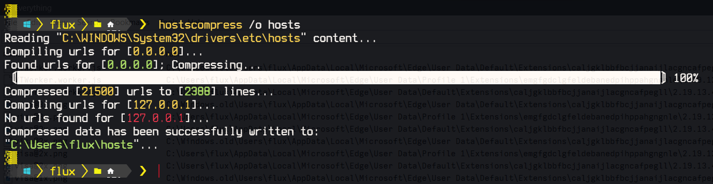

# Hosts Compress - Windows 


<!-- ---

***This project is*** ![Under Construction](https://img.shields.io/static/v1?logo=data:image/png;base64,iVBORw0KGgoAAAANSUhEUgAAAA4AAAAOCAYAAAAfSC3RAAACmElEQVQokUWSa0iTcRTGn//26u4b6ZQ0U8lKMqykwPpgZVBEHyLp8jEoIZJADCQ0iCiStIwuZmHRioIuroQss2VkrkIrdeFckiZqdhctTXPOve8Tr7M6X8/zO+fwPEfIwy7IwQA0GgExGYQwyhCmMLRX1z2hJCJSN+xZgqAZnPgCaAUQ0EHICjSYLlKBCDdNQb7HLmeRoy3zQFnzYk/1WTckGUIXCVD+Kw+BpAxtuBXCpkN7bdXt/JL3W3J3xuHg3iTsL/NkNFWVPoWkQOj/wxooCrRhFgiTjI4n9ZVHHQObjxVEY8UGIi1zEhVFCahwdq5qvn+hHkKC0EcBigxwvAnkW3ge7L6TMi+VztOLOOKOY8ulKL68GM2emnjeLF3AZSlz2FCZ6yaHwLGv6pkv8MyxsUoHLcsLwBuHwE0rtdy2UuLWNTpmpkkszQEfnAPDAd47tbaB7NaJR+eXujfmtGTUXgFWp5uwPd8Oi1GBJEmwWYlP34L4PSFw7chPeD+MYnkWUVmy0CeNfe5N8ANIjNWpNmHzqklYrDIGRwRm2gXsM/xofRMOf1AgcbYOAfgxMvgxCmS9+dbh5A6VarxuIMdBDoJ0g+vSreytNpAEux7qqWrK82I+kC2xYOAzyFbz5QNJPrXhdRo4XK/n3WILkxPsbKqwsr8xBB3PjukhGyJJv+qqB+QvkN0mR2Fim5pU1hobzxTYOPbcyJoTNpoAlu6wdZKvIslR0O9VXe0Clc5p2Ge4WDh36ux3ThM/1RqnNhXvilU32cjvINtAf4cKdkzlSHpBTqgNY11JfLtFA+o14NU8Wx/piggNfg2yGVR8EF9/dP37PyCIoDQLs8z9hmv71nsC4wFz9klX2tD4/AEG+gBoQ7KghD8MZ2xdnt7s7wAAAABJRU5ErkJggg==&label=Under&message=Construction&style=for-the-badge&labelColor=1D1D1D&color=ffff99), but coming very soon.

For now there are (much slower than this, but working well) scripts for Windows and Linux at my other *hosts compression* project located [***here***](https://github.com/Lateralus138/hosts-compress-windows). -->

- [Hosts Compress - Windows ](#hosts-compress---windows-)
  - [About](#about)
    - [Description](#description)
    - [Motivation](#motivation)
  - [Usage](#usage)
    - [Environment](#environment)
    - [How To Use](#how-to-use)
    - [Examples](#examples)
  - [Project Information](#project-information)
    - [Changelog](#changelog)
      - [Coming fixes](#coming-fixes)
    - [Source File Quality](#source-file-quality)
    - [File MD5 Hashes](#file-md5-hashes)
      - [Current Windows X86 MD5](#current-windows-x86-md5)
      - [Current Windows X64 MD5](#current-windows-x64-md5)
    - [Other Miscellaneous File Information](#other-miscellaneous-file-information)
  - [Notes](#notes)
    - [Note 1](#note-1)
    - [Note 2](#note-2)
    - [Note 3](#note-3)
    - [Note 4](#note-4)
  - [Media](#media)
  - [Support Me If You Like](#support-me-if-you-like)
  - [LICENSE](#license)


---

## About

This is a Windows command line utility that compresses (consolidates) multiple blocked (blocked with *0.0.0.0* and/or *127.0.0.1*) URLs to a single IP line in a system's *hosts file*<sup>[[1](#note-1)]</sup> with a few options such as setting the URL count (`/c, /count`) per IP line, discarding (`/d, /discard`) any extra content other than the IPs, and provisions for setting the input and output files (`/i, /input` and `/o, /output` respectively). The default output is to the console, but can be directed to a file with the afore mentioned `/o` argument. The default input file is the default Windows path (*C:\Windows\System32\drivers\etc\hosts*), but you can provide any other path with the afore mentioned `/i` argument, of course.

I have written the Windows version as the primary version and first because there only seems to be a problem with large hosts files in Windows because of the *DNS Cache* service.

This is the evolutionary step up from my [scripts](https://github.com/Lateralus138/hosts-compress-windows) (*PowerShell* and *Bash*) as it is written in *C++* and exponentially faster (whereas the scripts can take anwyhere from 3-5 minutes for a 200k+ line file, this program takes under 1 second; usually around 500ms for a file of the same size) than any script could ever be.

***NOTE***: **This tool is highly recommended over the scripts, but you can, of course, still use the scripts.**

### Description

 The *hosts* file is a text file in all (that I know of) operating systems that maps hostnames[[2](#note-2)]</sup> (google.com for example) to IP addresses[[3](#note-3)]</sup> (0.0.0.0 or 127.0.0.1 for examples) and they can become very large if you use a custom one (especially a consolidated one such as one of [Steven Black's](https://github.com/StevenBlack/hosts)). In *Linux* the file's size is not much of an issue, but in Windows (especially) this can slow down DNS caching and therefore cause internet/application issues such as slowing down the internet/external network or even bringing the internet to a halt. A way to circumvent this issue is to *compress* (or aggregate) multiple host names into single lines (or disable the DNS Client, which I definitely do not recommend for various reasons (and especially if you use WSL)). Windows can handle 9 hostnames per line; for example:

 ```
 0.0.0.0 fakename_1.url fakename_2.url fakename_3.url fakename_4.url fakename_5.url fakename_6.url fakename_7.url fakename_8.url fakename_9.url
 ```

 whereas Linux has no limit (that I know of; I have tested 10000 names on a single line).

 Therefore it's a great idea to compress larges hosts files, especially in Windows and one can do so with the tool found here. My last compression (as of the official release of this project) turned 189k+ hostnames into 21k+ lines and went from an hour plus of no internet after boot to instantaneous internet.

 NOTE: There's a misconception that the hosts file's file size matters (some people say over 1MB is problematic) and it really doesn't. It's more about the number or URLS per IP line. For example; a file size of 6MB+ compresses down to 5MB and runs exponentially better to near unnoticeable. 

I will be release a *Linux* version shortly, but to be honest it's not really needed. I am only releasing it because not much alteration to the Windows source is needed to convert it for Linux and you never know, someone may want to use it.

### Motivation

A need to use a large hosts file in Windows and actually have access to the internet.

---

## Usage

### Environment

This is a Windows command line tool with arguments and as such can be run from any console/terminal, Run, shortcut, AutoHotkey, or any other method of launching a console application in the Windows environment. 

The main focus for now is Windows and Linux, but as stated in the [Motivation](#motivation) section the whole reason I started this is for the shipwreck that is the Windows environment. I love Windows and Linux, but to deny there are some issues in Windows (in both really, but most notably Windows) is folly.

### How To Use

As with any portable program this can be placed anywhere you like on your machine, but more preferably in a directory that is in your `%PATH%` environment variable so you can run it without a full path (`hostscompress` for example). I recommend using a dedicated *Bin* directory, but of course, it's your choice. If your path isn't already in your `%PATH%` environment then I suggest adding it<sup>[[4](#note-4)]</sup>, but if not then you have provide the full path (`C:\Path\To\hostscompress.exe` for example) when executing the program.

### Examples

Here you can find basic examples of how to use this specific program, but for more information about how to work with the *hosts file* (such as replace) you can hop on over to my "Hosts Compression Scripts" repository located here:
[https://github.com/Lateralus138/hosts-compress-windows](https://github.com/Lateralus138/hosts-compress-windows).

Get Help:

```
 PS> hostscompress /help

  Hosts Compress - Consolidate multiple blocked URLs to single IP lines in a
  systems's hosts file with various options.

  @USAGE
    hostscompress [SWITCHES] [[OPTIONS] <PARAMS>]

  @SWITCHES:
    /h, /help       This help message.
    /m, /monochrome Verbose output is void of color.
    /q, /quiet      No verbosity; silences all errors and output with the errors
                    and output with the exception of the resulting compression
                    results if no output file is provided.
    /d, discard     Discard everything except the compressed lines from the
                    resulting output. This is only recommended if the HOSTS file
                    is only used for blocking URLs.

  @OPTIONS:
    /i, /input      Path to an optional INPUT FILE to parse. Defaults to the
                    default system hosts file location.
    /o, /output     Path to an optional OUTPUT FILE. The default is to output
                    to the console.
    /c, count       NUMBER of URLs to compress to a single line. The default is
                    9 (2-9)
```

Compress URLs of the default hosts file and display in the console:

```
 PS> hostscompress
 Reading "C:\WINDOWS\System32\drivers\etc\hosts" content...
Compiling urls for [0.0.0.0]...
Found urls for [0.0.0.0]; Compressing...
〘████████████████████████████████████████████████████████████████████████████████████████████████████〙100%
Compressed [193500] urls to [21500] lines...
Compiling urls for [127.0.0.1]...
No urls found for [127.0.0.1]...
# Title: StevenBlack/hosts
#
# This hosts file is a merged collection of hosts from reputable sources,
# with a dash of crowd sourcing via GitHub
#
# Date: 11 September 2023 01:16:59 (UTC)
# Number of unique domains: 193,508
#
# Fetch the latest version of this file: https://raw.githubusercontent.com/StevenBlack/hosts/master/hosts
# Project home page: https://github.com/StevenBlack/hosts
# Project releases: https://github.com/StevenBlack/hosts/releases
#
# ===============================================================

127.0.0.1 localhost
127.0.0.1 localhost.localdomain
127.0.0.1 local
255.255.255.255 broadcasthost
::1 localhost
::1 ip6-localhost
::1 ip6-loopback
fe80::1%lo0 localhost
ff00::0 ip6-localnet
ff00::0 ip6-mcastprefix
ff02::1 ip6-allnodes
ff02::2 ip6-allrouters
ff02::3 ip6-allhosts
0.0.0.0 0.0.0.0

# Custom host records are listed here.


# End of custom host records.
# Start StevenBlack

#=====================================
# Title: Hosts contributed by Steven Black
# http://stevenblack.com

0.0.0.0 ck.getcookiestxt.com eu1.clevertap-prod.com wizhumpgyros.com coccyxwickimp.com webmail-who-int.000webhostapp.com 010sec.com 01mspmd5yalky8.com 0byv9m0.0.0.0 aircovid19virus.com 
...
...
...
```

Compress URLs of the default hosts file and display in the console with only 3 urls per line and discarding excess:

```
 PS> hostscompress /c 3 /d
 Reading "C:\WINDOWS\System32\drivers\etc\hosts" content...
Compiling urls for [0.0.0.0]...
Found urls for [0.0.0.0]; Compressing...
〘████████████████████████████████████████████████████████████████████████████████████████████████████〙100%
Compressed [193500] urls to [21500] lines...
Compiling urls for [127.0.0.1]...
No urls found for [127.0.0.1]...
0.0.0.0 ck.getcookiestxt.com eu1.clevertap-prod.com wizhumpgyros.com
0.0.0.0 coccyxwickimp.com webmail-who-int.000webhostapp.com 010sec.com
0.0.0.0 01mspmd5yalky8.com 0byv9m0.0.0.0 aircovid19virus.com 
...
...
...
```

Compress URLs of the default hosts file and write to a new file in the current directory:

```
 PS> hostscompres /o .\hosts
Reading "C:\WINDOWS\System32\drivers\etc\hosts" content...
Compiling urls for [0.0.0.0]...
Found urls for [0.0.0.0]; Compressing...
〘████████████████████████████████████████████████████████████████████████████████████████████████████〙100%
Compressed [193500] urls to [21500] lines...
Compiling urls for [127.0.0.1]...
No urls found for [127.0.0.1]...
Compressed data has been successfully written to:
"C:\Users\<USERNAME>\hosts"...
 PS>
```

Benchmark process (Measure-Object won't work here for now):

```
 PS> Function Epoch() { return [decimal] [datetimeoffset]::UtcNow.ToUnixTimeMilliseconds() }
 PS> $begin = Epoch; hostscompress.exe /o hosts; $end = Epoch; [String]($end - $begin) + "ms"
Reading "C:\WINDOWS\System32\drivers\etc\hosts" content...
Compiling urls for [0.0.0.0]...
Found urls for [0.0.0.0]; Compressing...
〘████████████████████████████████████████████████████████████████████████████████████████████████████〙100%
Compressed [193500] urls to [21500] lines...
Compiling urls for [127.0.0.1]...
No urls found for [127.0.0.1]...
Compressed data has been successfully written to:
"C:\Users\<USERNAME>\hosts"...
778ms
```

---

## Project Information

&#x54;&#x68;&#x69;&#x73;&#x20;&#x70;&#x72;&#x6f;&#x6a;&#x65;&#x63;&#x74;&#x20;&#x69;&#x73;&#x20;&#x77;&#x72;&#x69;&#x74;&#x74;&#x65;&#x6e;&#x20;&#x69;&#x6e;&#x20;`C++`.

[![C++](https://img.shields.io/endpoint?url=https://raw.githubusercontent.com/Lateralus138/hosts-compress-windows/master/docs/json/cpp.json&logo=data%3Aimage%2Fpng%3Bbase64%2CiVBORw0KGgoAAAANSUhEUgAAABAAAAAQCAMAAAAoLQ9TAAAABGdBTUEAALGPC%2FxhBQAAACBjSFJNAAB6JgAAgIQAAPoAAACA6AAAdTAAAOpgAAA6mAAAF3CculE8AAABcVBMVEUAAAAAgM0Af8wolNQAa7YAbbkAQIcAQIYAVJ0AgM0AgM0AgM0AgM0AgM0AgM0AgM0AgM0AgM0AgM0Af8wAfswAfswAf8wAgM0AgM0AgM0Af80AgM0AgM0AgM0AgM0Af8wAgM0Af80djtIIg84Af8wAfsxYrN4Fg84Gg85RqNwej9MLhM8LhM8AfcsAgM0Hg88AfsshkNNTqd1%2Fv%2BUXi9AHdsAAYKoAY64ih8kAf81YkcEFV54GV55Sj8EnlNULhc8AecYdebwKcrsAe8gAb7oAXacAXqgAcLwAImUAUpoAVJ0AUpwAUZoAIWMAVJ0AVJ0AUpwAUZwAVJ0AVJ0AVJ0AVJ0AgM0cjtJqteGczetqtOEAf807ndjL5fT9%2Fv7%2F%2F%2F%2FM5fQ9ntnu9vu12vCi0Oz%2F%2F%2F6Hw%2Bebzeufz%2Bx%2Bv%2BW12e%2Bgz%2BxqteLu9fmRx%2BjL3Ovu8%2Fi1zeKrzeUAUpw7e7M8fLQAU50cZ6hqm8WcvNgAVJ3xWY3ZAAAAVnRSTlMAAAAAAAAAAAAREApTvrxRCQQ9rfX0qwErleyUKjncOFv%2B%2Fv5b%2Ff7%2B%2Fv7%2B%2Fv1b%2Ff7%2B%2Fv7%2BW%2F7%2B%2Fv79%2Fv7%2B%2Fv7%2B%2Fv7%2B%2Fjfa2jcBKJHqKAEEO6r0CVC8EFaOox4AAAABYktHRF9z0VEtAAAACXBIWXMAAA7DAAAOwwHHb6hkAAAAB3RJTUUH5QYKDQws%2FBWF6QAAAONJREFUGNNjYAABRkZOLkZGBhhgZOTm4eXjF4AJMQoKCYuEhYmKCQmCRBjFJSSlwiMiI6PCpaRlxBkZGGXlomNi4%2BLj4xISo%2BXkgQIKikqx8UnJyUnxKcqKKiAB1ajUJDV1Dc00LW0dXSaggF56fLK%2BgYFhhlGmsQkzRCDL1MzcIhsmYJkTn2tlbWObZ2cP0sKk4OCYH19QWFgQX%2BTkrMLEwOLiWlySD7I2v7TMzZ2Vgc3D08u7vKKysqLc28vHlx3oVg4%2F%2F4DAqqrAAH8%2FDohnODiCgkNCgoM4OOD%2B5eAIDYVyAZ9mMF8DmkLwAAAAJXRFWHRkYXRlOmNyZWF0ZQAyMDIxLTA2LTEwVDE4OjEyOjQ0LTA1OjAwkjvGQgAAACV0RVh0ZGF0ZTptb2RpZnkAMjAyMS0wNi0xMFQxODoxMjo0NC0wNTowMONmfv4AAAAASUVORK5CYII%3D)](http://www.cplusplus.org/)

### Changelog

  - 1.0.0.0 - Initial release.

#### Coming fixes
  
  - 1.1.0.0 - Regex match for `^(0.0.0.0|127.0.0.1)[\s]+(?!(0.0.0.0|127.0.0.1)).*` when searching for URLs fix.

### Source File Quality

&#x54;&#x68;&#x69;&#x73;&#x20;&#x69;&#x73;&#x20;&#x67;&#x72;&#x61;&#x64;&#x65;&#x64;&#x20;&#x62;&#x79;&#x20;&#x43;&#x6f;&#x64;&#x65;&#x46;&#x61;&#x63;&#x74;&#x6f;&#x72;&#x20;&#x61;&#x6e;&#x64;&#x20;&#x69;&#x73;&#x20;&#x73;&#x75;&#x62;&#x6a;&#x65;&#x63;&#x74;&#x69;&#x76;&#x65;&#x2c;&#x20;&#x62;&#x75;&#x74;&#x20;&#x68;&#x65;&#x6c;&#x70;&#x73;&#x20;&#x6d;&#x65;&#x20;&#x74;&#x6f;&#x20;&#x72;&#x65;&#x66;&#x61;&#x63;&#x74;&#x6f;&#x72;&#x20;&#x6d;&#x79;&#x20;&#x77;&#x6f;&#x72;&#x6b;&#x2e;

|                                                Name                                                 |                                                                        Status                                                                        |
| :-------------------------------------------------------------------------------------------------: | :--------------------------------------------------------------------------------------------------------------------------------------------------: |
| [codefactor.io](https://www.codefactor.io/repository/github/lateralus138/hosts-compress-windows) |  |

### File MD5 Hashes

&#x41;&#x6c;&#x6c;&#x20;&#x68;&#x61;&#x73;&#x68;&#x65;&#x73;&#x20;&#x61;&#x72;&#x65;&#x20;&#x72;&#x65;&#x74;&#x72;&#x69;&#x65;&#x76;&#x65;&#x64;&#x20;&#x61;&#x74;&#x20;&#x63;&#x6f;&#x6d;&#x70;&#x69;&#x6c;&#x65;&#x2f;&#x62;&#x75;&#x69;&#x6c;&#x64;&#x20;&#x74;&#x69;&#x6d;&#x65;&#x2e;

#### Current Windows X86 MD5


#### Current Windows X64 MD5


### Other Miscellaneous File Information

|           Description            |                                                                                Status                                                                                |
| :------------------------------: | :------------------------------------------------------------------------------------------------------------------------------------------------------------------: |
|       Project Release Date       |          |
| Total downloads for this project |       |
|     Complete repository size     |                  |
|      Commits in last month       |  |
|       Commits in last year       |  |

---

## Notes

### Note 1

[hosts file search @ DuckDuckGo](https://duckduckgo.com/?q=hosts+file&ia=web)

### Note 2

[what is host/domain name search @ DuckDuckGo](https://duckduckgo.com/?q=what+is+host%2Fdomain+name&ia=web)

### Note 3

[what is an IP address search @ DuckDuckGo](https://duckduckgo.com/?q=what+is+an+ip+address&ia=web)

### Note 4

[Adding a path to the Windows %PATH% environment variable search @ DuckDuckGo](https://duckduckgo.com/?q=Adding+a+path+to+the+Windows+%25PATH%25+environment+variable&ia=web)

---

## Media

Logo


Help


Example



---

## Support Me If You Like

&#x49;&#x66;&#x20;&#x79;&#x6f;&#x75;&#x20;&#x6c;&#x69;&#x6b;&#x65;&#x20;&#x61;&#x6e;&#x79;&#x20;&#x6f;&#x66;&#x20;&#x74;&#x68;&#x65;&#x20;&#x70;&#x72;&#x6f;&#x6a;&#x65;&#x63;&#x74;&#x73;&#x20;&#x62;&#x65;&#x6c;&#x6f;&#x77;&#x20;&#x61;&#x6e;&#x64;&#x20;&#x63;&#x61;&#x72;&#x65;&#x20;&#x74;&#x6f;&#x20;&#x64;&#x6f;&#x6e;&#x61;&#x74;&#x65;&#x20;&#x74;&#x6f;&#x20;&#x6d;&#x79;&#x20;***PayPal***&#x3a;

[](https://paypal.me/ianapride?locale.x=en_US)

&#x4f;&#x72;&#x20;***Buy Me A Coffee***&#x20;&#x69;&#x66;&#x20;&#x79;&#x6f;&#x75;&#x72;&#x20;&#x70;&#x72;&#x65;&#x66;&#x65;&#x72;&#x3a;

[](https://www.buymeacoffee.com/ianalanpride)

---

## [LICENSE](./LICENSE)


<details>
  <summary>&#x4C;&#x69;&#x63;&#x65;&#x6E;&#x73;&#x65;&#x20;&#x45;&#x78;&#x63;&#x65;&#x72;&#x70;&#x74;</summary>
  <br>
  <blockquote>
  &#x20;&#x54;&#x68;&#x69;&#x73;&#x20;&#x70;&#x72;&#x6F;&#x67;&#x72;&#x61;&#x6D;&#x20;&#x69;&#x73;&#x20;&#x66;&#x72;&#x65;&#x65;&#x20;&#x73;&#x6F;&#x66;&#x74;&#x77;&#x61;&#x72;&#x65;&colon;&#x20;&#x79;&#x6F;&#x75;&#x20;&#x63;&#x61;&#x6E;&#x20;&#x72;&#x65;&#x64;&#x69;&#x73;&#x74;&#x72;&#x69;&#x62;&#x75;&#x74;&#x65;&#x20;&#x69;&#x74;&#x20;&#x61;&#x6E;&#x64;&sol;&#x6F;&#x72;&#x20;&#x6D;&#x6F;&#x64;&#x69;&#x66;&#x79;&#x20;&#x69;&#x74;&#x20;&#x75;&#x6E;&#x64;&#x65;&#x72;&#x20;&#x74;&#x68;&#x65;&#x20;&#x74;&#x65;&#x72;&#x6D;&#x73;&#x20;&#x6F;&#x66;&#x20;&#x74;&#x68;&#x65;&#x20;&#x47;&#x4E;&#x55;&#x20;&#x47;&#x65;&#x6E;&#x65;&#x72;&#x61;&#x6C;&#x20;&#x50;&#x75;&#x62;&#x6C;&#x69;&#x63;&#x20;&#x4C;&#x69;&#x63;&#x65;&#x6E;&#x73;&#x65;&#x20;&#x61;&#x73;&#x20;&#x70;&#x75;&#x62;&#x6C;&#x69;&#x73;&#x68;&#x65;&#x64;&#x20;&#x62;&#x79;&#x20;&#x74;&#x68;&#x65;&#x20;&#x46;&#x72;&#x65;&#x65;&#x20;&#x53;&#x6F;&#x66;&#x74;&#x77;&#x61;&#x72;&#x65;&#x20;&#x46;&#x6F;&#x75;&#x6E;&#x64;&#x61;&#x74;&#x69;&#x6F;&#x6E;&comma;&#x20;&#x65;&#x69;&#x74;&#x68;&#x65;&#x72;&#x20;&#x76;&#x65;&#x72;&#x73;&#x69;&#x6F;&#x6E;&#x20;&#x33;&#x20;&#x6F;&#x66;&#x20;&#x74;&#x68;&#x65;&#x20;&#x4C;&#x69;&#x63;&#x65;&#x6E;&#x73;&#x65;&comma;&#x20;&#x6F;&#x72;&#x20;&lpar;&#x61;&#x74;&#x20;&#x79;&#x6F;&#x75;&#x72;&#x20;&#x6F;&#x70;&#x74;&#x69;&#x6F;&#x6E;&rpar;&#x20;&#x61;&#x6E;&#x79;&#x20;&#x6C;&#x61;&#x74;&#x65;&#x72;&#x20;&#x76;&#x65;&#x72;&#x73;&#x69;&#x6F;&#x6E;&period;
  </blockquote>
  <br>
  <blockquote>
  &#x54;&#x68;&#x69;&#x73;&#x20;&#x70;&#x72;&#x6F;&#x67;&#x72;&#x61;&#x6D;&#x20;&#x69;&#x73;&#x20;&#x64;&#x69;&#x73;&#x74;&#x72;&#x69;&#x62;&#x75;&#x74;&#x65;&#x64;&#x20;&#x69;&#x6E;&#x20;&#x74;&#x68;&#x65;&#x20;&#x68;&#x6F;&#x70;&#x65;&#x20;&#x74;&#x68;&#x61;&#x74;&#x20;&#x69;&#x74;&#x20;&#x77;&#x69;&#x6C;&#x6C;&#x20;&#x62;&#x65;&#x20;&#x75;&#x73;&#x65;&#x66;&#x75;&#x6C;&comma;&#x20;&#x62;&#x75;&#x74;&#x20;&#x57;&#x49;&#x54;&#x48;&#x4F;&#x55;&#x54;&#x20;&#x41;&#x4E;&#x59;&#x20;&#x57;&#x41;&#x52;&#x52;&#x41;&#x4E;&#x54;&#x59;&semi;&#x20;&#x77;&#x69;&#x74;&#x68;&#x6F;&#x75;&#x74;&#x20;&#x65;&#x76;&#x65;&#x6E;&#x20;&#x74;&#x68;&#x65;&#x20;&#x69;&#x6D;&#x70;&#x6C;&#x69;&#x65;&#x64;&#x20;&#x77;&#x61;&#x72;&#x72;&#x61;&#x6E;&#x74;&#x79;&#x20;&#x6F;&#x66;&#x20;&#x4D;&#x45;&#x52;&#x43;&#x48;&#x41;&#x4E;&#x54;&#x41;&#x42;&#x49;&#x4C;&#x49;&#x54;&#x59;&#x20;&#x6F;&#x72;&#x20;&#x46;&#x49;&#x54;&#x4E;&#x45;&#x53;&#x53;&#x20;&#x46;&#x4F;&#x52;&#x20;&#x41;&#x20;&#x50;&#x41;&#x52;&#x54;&#x49;&#x43;&#x55;&#x4C;&#x41;&#x52;&#x20;&#x50;&#x55;&#x52;&#x50;&#x4F;&#x53;&#x45;&period;&#x20;&#x20;&#x53;&#x65;&#x65;&#x20;&#x74;&#x68;&#x65;&#x20;&#x47;&#x4E;&#x55;&#x20;&#x47;&#x65;&#x6E;&#x65;&#x72;&#x61;&#x6C;&#x20;&#x50;&#x75;&#x62;&#x6C;&#x69;&#x63;&#x20;&#x4C;&#x69;&#x63;&#x65;&#x6E;&#x73;&#x65;&#x20;&#x66;&#x6F;&#x72;&#x20;&#x6D;&#x6F;&#x72;&#x65;&#x20;&#x64;&#x65;&#x74;&#x61;&#x69;&#x6C;&#x73;&period;
  </blockquote>
</details>